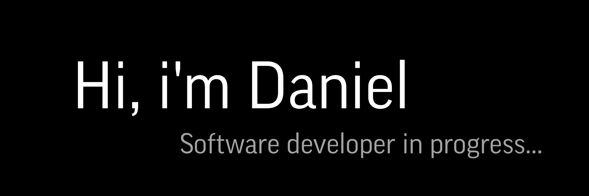

<!-- ### Hi there, I am Daniel 👋
> Software developer in progress... -->

<!-- - 📫 How to reach me **danisiliente@gmail.com** -->

<!-- # 💻 Skills: -->
 
 
 

 
 

 
 

  
<picture></picture>
<picture></picture>
<picture></picture>
